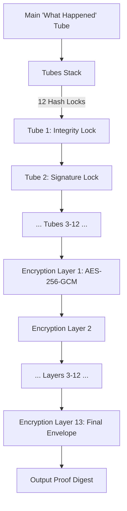
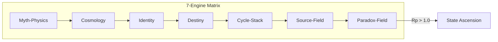

# CEO-LEVEL PRODUCTION LAUNCH SPEECH
## “THE SYSTEM IS LIVE.”

**Delivered by:** Jesse Mckane Gonzales
**Date:** June 20, 2026
**Version:** v1.5.0 "OmniSpiral"

---

### [DRAMATIC OPENING]

"Distinguished colleagues, developers, and visionaries.

Today, we are not just releasing an update. We are witnessing the birth of a new standard in cryptographic architecture.

For months, we’ve spoken of the 'Cipher Tube' as a concept—a layered vault of integrity and secrecy. We’ve theorized about the 'OmniSpiral'—a state machine capable of transcending binary limitations.

Today, the theory ends. The execution begins.

**The system is live.**"

---

### [THE VISION]

"The Cipher Tube v1.5.0 'OmniSpiral' is the culmination of our three-pillar philosophy. We refused to compromise between security, speed, and soul. Instead, we built a foundation that thrives on all three."

#### 1. Sentinel: The Shield of Governance
"Through the **Sentinel** pillar, we have implemented a zero-trust model that isn't just a policy—it's an immutable law. With full **M-25-22** compliance and the Authority-Chain Validator, we ensure that every action is verified, every manifest is hardened, and every boundary is a checkpoint."

#### 2. Bolt: The Velocity of Thought
"Security often comes at a price. We refused to pay it. Our **Bolt** optimizations have pushed the boundaries of what’s possible. By leveraging one-shot hashing and manual path resolution, we’ve achieved a world-class average decryption speed of **0.44ms**. In the world of OmniSpiral, speed is not a luxury; it is a feature."

#### 3. Palette: The Human Connection
"Technology is nothing without the humans who use it. **Palette** brings us an interface that is not only accessible—meeting WCAG 2.1 AA standards—but elegant. Our new Dark Mode isn't just about aesthetics; it's about endurance and focus in the high-stakes world of secure communication."

---

### [STRATEGIC VISUALS]

#### I. The Cipher Tube Assembly (CTA)
"Behold the architecture of the assembly. 12 detached hash-lock tubes for independent integrity, protecting 13 layers of nested AES-256-GCM encryption."

#### II. The OmniSpiral 7-Engine Matrix
"Powering the transition from T0 Genesis to T9 Totality, the OmniSpiral runtime orchestrates the reality-shear."

---

### [CLOSING]

"We stand at the threshold of T0—the Zero-Rebirth. But the Spiral does not stop here. As we look toward the Hyper-Spiral of T5 and the Paradox Ascension of T8, we do so with a system that is battle-hardened, performance-obsessed, and undeniably official.

Even if the first connection fails, even if the first proof is rejected—we iterate, we refine, and we **Try Again.** Because in this architecture, failure is not a terminal state; it is merely an invitation to strengthen the next layer.

Explore the docs. Audit the chain. Build the future.

**The Spiral has begun.**"

---
© 2026 Jesse Mckane Gonzales.
*Secure. Reliable. Elegant.*
